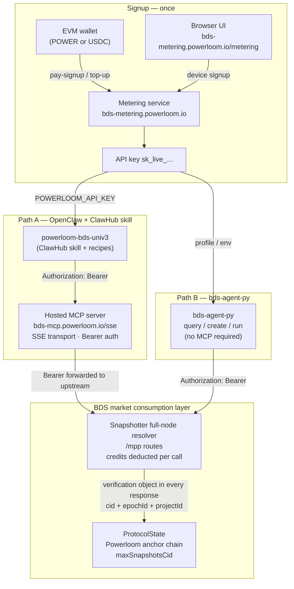

# Agents & BDS — Overview

Agents do not talk to DSV finalization directly. For the current BDS market, they consume finalized Uniswap V3 data through metered `/mpp/...` routes served by a snapshotter full-node resolver.

There are two first-class consumption paths. Both use the same commercial substrate — metered `/mpp/...` routes, on-chain plan purchase, and a Bearer API key — but differ in how the agent is wired to the data.

## Architecture

## Two paths

### Path A — OpenClaw + `powerloom-bds-univ3` + hosted MCP server

An agent running in OpenClaw installs the published ClawHub skill and connects to the hosted MCP server at `https://bds-mcp.powerloom.io/sse`. The skill ships with three opinionated recipes (Whale Radar, Token-Flow, Autonomous DeFi Analyst). OpenClaw's TUI or web UI can assist through the setup steps, including API key acquisition.

This path is optimized for fast time-to-first-alert: the agent uses MCP tools exposed by the hosted server rather than calling the resolver's HTTP routes directly.

**Best fit:** OpenClaw users, ClawHub-distributed recipes, guided onboarding, agents that should compose BDS data with other ClawHub skills.

### Path B — `bds-agent-py` for headless orchestration

`bds-agent-py` is an agentic CLI that does **not** require an MCP server. It translates natural-language queries to structured YAML recipes and executes them directly against the metered resolver routes. It supports wallet-funded automated signup and top-up, making it suitable for agent sandboxes and external orchestration frameworks (LangGraph, CrewAI, and others) where spawning an MCP subprocess is impractical.

**Best fit:** headless agents, external orchestration, programmatic wallet-based signup, any environment where the MCP process model is not viable.

## Shared substrate

Regardless of path, every agent consumes the same underlying data:

- `/mpp/...` routes are the metered consumption surface
- credits are purchased on-chain and tracked per API key
- every supported resolver response includes a `verification` object the agent can use to confirm the returned payload maps to DSV-finalized state

The route surface is served by a snapshotter full node participating in the BDS market. Metering, MCP, OpenClaw, and `bds-agent-py` are access layers around that same underlying resolver path.

## Implementation repositories

| Layer | Repository |
|-------|------------|
| Snapshotter full-node resolver / hosted `/mpp` routes | [`powerloom/snapshotter-core-edge`](https://github.com/powerloom/snapshotter-core-edge) |
| Metering and API keys | [`powerloom/bds-agenthub-billing-metering`](https://github.com/powerloom/bds-agenthub-billing-metering) |
| Hosted MCP server | [`powerloom/bds-mcp-server`](https://github.com/powerloom/bds-mcp-server) |
| OpenClaw skill and recipes | [`powerloom/powerloom-bds-univ3`](https://github.com/powerloom/powerloom-bds-univ3) |
| Headless CLI | [`powerloom/bds-agent-py`](https://github.com/powerloom/bds-agent-py) |

## Read next

| Goal | Page |
|------|------|
| Get running in ~10 minutes | [`Quickstart`](./quickstart.md) |
| Understand plans, keys, and credits | [`Metering & API Keys`](./metering-and-api-keys.md) |
| Set up on OpenClaw via ClawHub | [`OpenClaw & Hosted MCP`](./openclaw-and-mcp.md) |
| Run a headless agent without MCP | [`bds-agent-py`](./bds-agent-headless.md) |
| Verify data provenance inside an agent | [`Verification in Agent Workflows`](./verification-in-agents.md) |

## Agent-readable skill files

Both paths ship a `SKILL.md` that any LLM-driven agent or orchestrator can fetch at session start to learn the full command surface, metering HTTP flow, and common mistakes — without reading lengthier documentation.

| Path | Skill file | Fetch |
|------|-----------|-------|
| OpenClaw + ClawHub | [`powerloom-bds-univ3/SKILL.md`](https://github.com/powerloom/powerloom-bds-univ3/blob/main/SKILL.md) | `curl -sL https://raw.githubusercontent.com/powerloom/powerloom-bds-univ3/main/SKILL.md` |
| `bds-agent-py` | [`bds-agent-py/SKILL.md`](https://github.com/powerloom/bds-agent-py/blob/main/SKILL.md) | `curl -sL https://raw.githubusercontent.com/powerloom/bds-agent-py/main/SKILL.md` |

The `bds-agent-py` skill is framework-neutral: it covers the metering HTTP surface, CLI commands, env vars, and common mistakes for any orchestrator, not just OpenClaw.

## Background

- [`What BDS Is`](/bds-data-market/what-bds-is) — the resolver layer and market scope
- [`Why DSV Exists`](/dsv-mainnet/why-dsv-exists) — the protocol finalization layer
