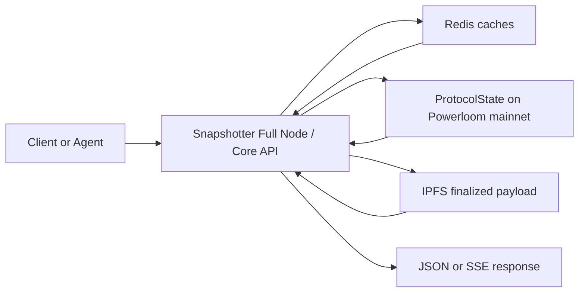

# Snapshotter Full Node as Resolver

The snapshotter full node is the serving layer for BDS. It does more than proxy IPFS content and more than mirror contract state. It resolves finalized protocol outputs into application-ready HTTP responses.

## What the resolver is doing

At request time, the full node combines four inputs:

- **anchor-chain state** through `ProtocolState`,
- **Redis caches** for finalized epochs and CIDs,
- **IPFS content** for finalized snapshot payloads,
- and **compute-specific parsing logic** for the response shape expected by the route.

That is why BDS should not be understood as "cached IPFS." IPFS stores the finalized payload. The full node resolves which payload is canonical for a project and epoch, retrieves it efficiently, and serves it in a structured form.

## Resolution path

## Why Redis, chain state, and IPFS are all involved

The resolver path exists because no single layer is enough by itself:

- **ProtocolState** is the canonical source for finalized project CIDs and epochs.
- **Redis** reduces repeated contract and payload lookups by caching finalized results and recently accessed data.
- **IPFS** stores the actual finalized payload content.
- **Core API handlers** turn that content into route-specific JSON responses.

The full node therefore acts as a resolver in the same sense that a name resolver maps a canonical identifier into a usable result. Here, the canonical identifier is a finalized CID for a market project and epoch.

## What happens on a snapshot request

For a project-and-epoch read, the full node:

1. determines the relevant project ID for the endpoint,
2. resolves the finalized CID for that project and epoch,
3. uses Redis when the CID or epoch metadata is already cached,
4. falls back to anchor-chain reads when the cache is cold,
5. fetches the finalized payload from IPFS,
6. parses the payload into the route's response model,
7. returns the result over HTTP or SSE.

In the current code path, `get_project_epoch_snapshot(...)` is the critical resolver function behind this behavior.

## Why this matters for product consumers

This design gives the consumer three properties at once:

- **finalized protocol data**, not ad hoc off-chain indexing,
- **low-latency reads** through cache-aware resolution,
- **application-ready response shapes** instead of raw payload decoding.

That is the reason BDS can feel like a normal API while still remaining tied to DSV finalization.

## More than single-epoch reads

The same full-node pattern supports:

- latest snapshot lookups,
- time-series windows,
- pool and token-derived analytics,
- and streaming of finalized events.

These higher-level routes are still rooted in finalized underlying snapshots. The serving layer is reusable because the resolver is reusable.

## Relationship to the older Core API docs

Powerloom's Core API documentation already explains that a snapshotter node exposes API services over finalized protocol state. BDS is the specialized market-facing version of that idea for the live Uniswap V3 data market.

## Related pages

- [`What BDS Is`](./what-bds-is.md)
- [`On-Chain Submission and Verification`](/dsv-mainnet/onchain-submission-and-verification)
- [`Verification Pattern`](./verification-pattern.md)
