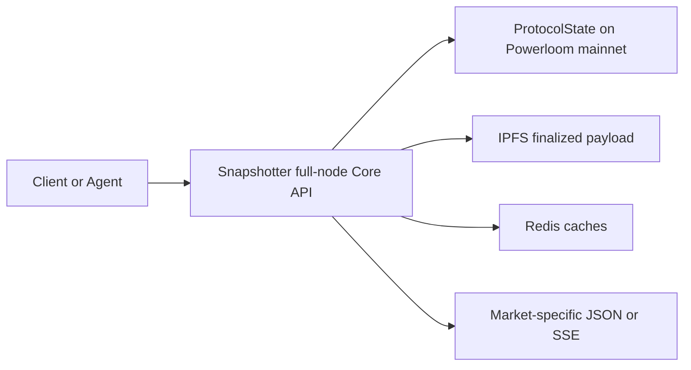

# Snapshotter Core API

The Snapshotter Core API is the HTTP serving layer exposed by a snapshotter full node. In the current BDS architecture, this role is best understood as a **resolver node**: it resolves finalized protocol outputs into application-ready API responses.

For BDS consumers, the product-facing version of this idea is documented in:

- [Snapshotter Full Node as Resolver](/bds-data-market/snapshotter-full-node-as-resolver)
- [Endpoint Catalog](/bds-data-market/endpoint-catalog)
- [Verification in Agent Workflows](/agents-and-bds/verification-in-agents)

## Where Core API Fits

A data market ecosystem has three separate concerns:

- **Data production:** snapshotter lite or full nodes compute market snapshots and submit them for DSV finalization.
- **Finalization:** DSV validators finalize canonical CIDs and anchor those references in `ProtocolState`.
- **Resolution and serving:** a snapshotter full node reads finalized state, retrieves payloads, applies market-specific parsing, and serves HTTP responses.

The Core API belongs to the third layer. It should not be treated as a separate source of truth. The source of truth is finalized protocol state; the API is a resolver that makes that state useful for applications and agents.

## Current BDS Resolver Path



The hosted BDS access path exposes this through metered `/mpp/...` routes. Route families are listed in the [Endpoint Catalog](/bds-data-market/endpoint-catalog).

## Verification Contract

Core API responses for BDS should preserve enough provenance for consumers to verify the result. Agent-facing BDS responses include a `verification` object with the CID, epoch, project ID, protocol state contract, and data market contract.

Agents can then confirm the response with:

```solidity
ProtocolState.maxSnapshotsCid(dataMarket, projectId, epochId)
```

See [Verification in Agent Workflows](/agents-and-bds/verification-in-agents) for the practical flow used by MCP tools, `bds-agent-py`, and downstream alerts.
