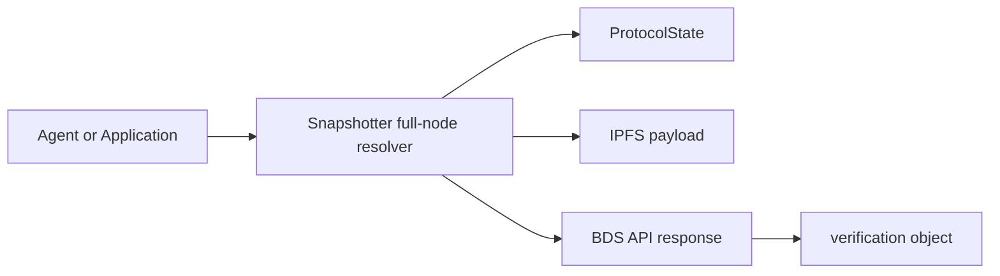

# All About Data

Powerloom data should be consumed as finalized protocol output, not as an opaque API response. In the current BDS direction, data access starts with resolver APIs and remains verifiable through the provenance attached to each response.

## Data Resolution Path

For BDS, a snapshotter full node acts as the resolver. It maps a consumer request to the correct project ID and epoch, resolves the finalized CID from Powerloom mainnet `ProtocolState`, retrieves the payload, and returns a market-specific response shape.

The resolver concept is documented in [Snapshotter Full Node as Resolver](/bds-data-market/snapshotter-full-node-as-resolver), and the current BDS route surface is listed in the [Endpoint Catalog](/bds-data-market/endpoint-catalog).

## Verification Comes With the Data

BDS responses from supported routes include a `verification` object. That object tells consumers how to check the API response against finalized on-chain state.

The important fields are:

- `cid`: the finalized content identifier,
- `epochId`: the finalized epoch or source block,
- `projectId`: the market-specific project identifier,
- `protocolState`: the Powerloom protocol state contract,
- `dataMarket`: the data market contract.

Consumers verify the response by checking `ProtocolState.maxSnapshotsCid(dataMarket, projectId, epochId)` and comparing the returned CID to `verification.cid`.

## Agent Workflows

Agent workflows should carry provenance forward. If an agent emits an alert, report, or downstream action from BDS data, it should include the verification block or a derived verification result.

The canonical guide is [Verification in Agent Workflows](/agents-and-bds/verification-in-agents). It covers:

- verifying a payload directly against `ProtocolState`,
- using the MCP `verify_data_provenance` tool,
- enabling `verify: true` in `bds-agent-py`,
- preserving provenance in alerts.

## Why This Matters

Resolver APIs make finalized data convenient to consume, but verification keeps them trust-minimized. Applications and agents get normal HTTP or SSE ergonomics while still being able to prove that a response maps to DSV-finalized state.
