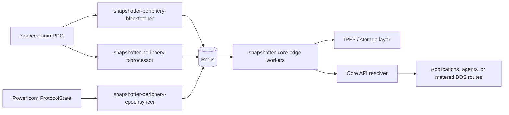

# Snapshotter Core Edge

The snapshotter full node is now represented by [`powerloom/snapshotter-core-edge`](https://github.com/powerloom/snapshotter-core-edge). It is not a lightweight single-machine onboarding path. It is the production-grade snapshotter stack for mature operators who can run, observe, and scale multiple services around a data market.

For most operators who only need to participate in the current BDS Mainnet market, use the [Snapshotter Lite V2 setup](/build-with-powerloom/snapshotter-node/lite-node-v2/getting-started). The full-node stack is for operators who can dedicate resources to the core service, Redis, IPFS or equivalent storage access, RPC capacity, and the `snapshotter-periphery-*` services.

## What Core Edge Does

`snapshotter-core-edge` is a modular full-node implementation. It combines:

- a core snapshotter service that coordinates epoch processing and workers,
- Redis-backed queues and caches,
- compute modules pulled into the runtime's `computes` layout,
- data-market configuration modules pulled into the runtime's `config` layout,
- peripheral services for block fetching, transaction processing, and epoch synchronization,
- and a Core API that exposes finalized data through resolver-style HTTP routes.

That Core API is why full nodes now also fill the role of **resolver nodes**. A resolver node turns finalized protocol outputs into application-ready API responses by resolving the right project ID, epoch, finalized CID, cached payload, and response shape.

## Fit in a Distributed Deployment

In a mature deployment, Core Edge should be treated as an orchestrated service group rather than a single process.

The `snapshotter-periphery-*` services are intended to be deployed and scaled separately:

- [`snapshotter-periphery-blockfetcher`](https://github.com/powerloom/snapshotter-core-edge/tree/main/snapshotter-periphery-blockfetcher) keeps source-chain block data available in Redis.
- [`snapshotter-periphery-txprocessor`](https://github.com/powerloom/snapshotter-core-edge/tree/main/snapshotter-periphery-txprocessor) prepares transaction data for downstream workers.
- [`snapshotter-periphery-epochsyncer`](https://github.com/powerloom/snapshotter-core-edge/tree/main/snapshotter-periphery-epochsyncer) watches epoch release events and forwards work when required block and transaction data is ready.

Seasoned operators can scale these services independently based on bottlenecks: RPC throughput, block ingestion, transaction processing, worker queue depth, Redis pressure, or API traffic.

## Resolver Node Role

The Core API is the serving layer for finalized data. For BDS, this is the same pattern described in [Snapshotter Full Node as Resolver](/bds-data-market/snapshotter-full-node-as-resolver).

At request time, a resolver node:

1. maps the API route to the relevant market-specific project ID,
2. resolves the finalized CID for the requested epoch from `ProtocolState`,
3. uses Redis for cached epoch and payload metadata,
4. retrieves the finalized payload from IPFS or the configured storage layer,
5. parses it through market-specific logic,
6. returns JSON or streaming responses to consumers.

The public BDS route surface is documented in the [Endpoint Catalog](/bds-data-market/endpoint-catalog). Agent-facing usage should preserve the provenance model described in [Verification in Agent Workflows](/agents-and-bds/verification-in-agents).

## Plug-In Data Market Model

Core Edge is designed to launch full nodes for different data markets by changing the compute and configuration modules that the build and run scripts pull at deployment time.

- **Compute modules** define how market-specific snapshots and aggregates are built.
- **Configuration modules** define project types, data sources, aggregation dependencies, preloaders, and market settings.
- **Workers** are generated and routed from those configs, allowing the same core runtime to support different market shapes.

This is the full-node counterpart to the BDS direction: a reusable resolver and worker runtime where markets are plugged in at runtime through compute and config modules rather than through a bespoke application stack.

## Operator Expectations

Run Core Edge when you are prepared to operate infrastructure, not just run a node binary. A realistic deployment needs:

- dedicated Redis capacity and monitoring,
- reliable source-chain RPC access with rate-limit planning,
- IPFS or compatible storage access,
- observability for worker queues, periphery services, and API latency,
- autoscaling or manual capacity planning for the `snapshotter-periphery-*` components,
- and deployment isolation between data ingestion, snapshot workers, and Core API serving.

Core Edge is therefore the right fit for data-market operators, resolver operators, and infrastructure teams supporting high-throughput markets. It is not the recommended path for slot operators joining BDS Mainnet; that path remains [Snapshotter Lite V2](/build-with-powerloom/snapshotter-node/lite-node-v2/getting-started).
