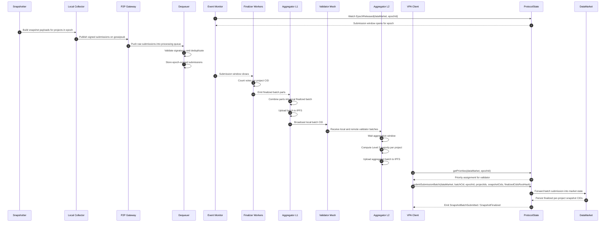

# Protocol Workflow

This page traces one epoch from snapshot creation to a finalized on-chain CID.

Protocol v2 already introduced off-chain sequencing, batching, IPFS upload, and on-chain anchoring. DSV extends that architecture by replacing the centralized sequencer with a decentralized sequencer-validator network.

The important idea is that DSV reaches consensus in two stages:

- **Level 1**: each validator builds its own local finalized batch from the submissions it collected;
- **Level 2**: validators compare those finalized batches and converge on a network-wide batch;
- **On-chain**: the validator with the right priority for that epoch anchors the agreed batch.

## End-to-end sequence

## Step-by-step

### 1. Epoch release

The workflow starts when `ProtocolState` emits `EpochReleased` for a data market. Validator-side event monitoring uses that signal plus market configuration to determine when the submission window is open.

For the BDS mainnet flow documented internally, the submission window is typically **45 seconds**, and the network aggregation window is **30 seconds** after local batches begin arriving.

### 2. Snapshot propagation

Snapshotters build project-specific snapshots for the active epoch. The local collector publishes those signed submissions into the libp2p mesh.

This is where DSV diverges from the Protocol v2 deployment model: transport no longer depends on routing all submissions into one centralized sequencer service operated as a monolithic control point.

### 3. Validation and deduplication

On each validator, the P2P gateway receives the gossipsub message and pushes it into the submission queue. The dequeuer then:

- verifies the EIP-712 signature,
- checks epoch and project metadata,
- removes duplicates by `(epoch, project, snapshotter)`, and
- stores the normalized submissions in epoch-scoped Redis keys.

This stage matters because it prevents a malicious or buggy peer from amplifying its own vote just by replaying the same submission.

### 4. Level 1 aggregation

When the submission window closes, finalizer workers compute the majority CID per project from the submissions the validator saw. Those worker outputs are then combined into a single local finalized batch.

That local batch:

- contains one consensus CID per project for the epoch,
- is uploaded to IPFS,
- is written into the validator's local state, and
- is broadcast to the rest of the validator mesh.

### 5. Level 2 aggregation

The second aggregation stage is what turns "my validator's view" into network consensus.

Each validator collects local and remote batch notifications during the aggregation window. When the timer expires, the validator computes the majority batch outcome per project across validator-produced batches. The result is a network-consensus batch with its own IPFS CID.

This second stage is why DSV can tolerate disagreement or partial failure at the submission level. Snapshotter submissions are voted on first; validator batches are voted on second.

### 6. Priority-based on-chain submission

After the network-consensus batch is ready, the VPA client determines whether a validator is allowed to submit for that epoch. `ProtocolState` enforces this by checking validator priority before accepting `submitSubmissionBatch(...)`.

That removes the race where multiple validators try to finalize the same epoch on-chain at once while still preserving decentralized participation. If a higher-priority validator misses its slot, lower-priority validators can submit according to the configured fallback windows.

### 7. Finalized state

On successful submission:

- `ProtocolState` records the market-scoped submission,
- the underlying `DataMarket` stores the finalized CID for each `(projectId, epochId)`,
- events such as `SnapshotBatchSubmitted` and `SnapshotFinalized` are emitted, and
- consumers can later retrieve the canonical CID through `maxSnapshotsCid(...)`.

That final read path is what powers independent verification for BDS and any other consumer-facing data product built on top of DSV.

## Why this workflow scales better

DSV improves on the Protocol v2 centralized sequencer model in three concrete ways:

1. **It keeps intermediate transport off-chain.** Only the canonical outputs need to be anchored.
2. **It distributes sequencing responsibility.** Finalization no longer depends on one Foundation-operated sequencer boundary for every market.
3. **It preserves auditability.** Consumers can still reconstruct trust by checking the final CID, contract state, and IPFS payload.

## Related pages

- [`Roles and Topology`](./roles-and-topology.md)
- [`On-Chain Submission and Verification`](./onchain-submission-and-verification.md)
